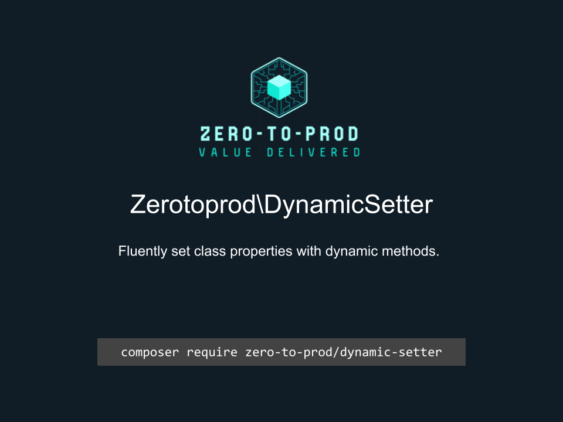

# Zerotoprod\DynamicSetter



[](https://github.com/zero-to-prod/dynamic-setter)
[](https://github.com/zero-to-prod/dynamic-setter/actions)
[](https://packagist.org/packages/zero-to-prod/dynamic-setter/stats)
[](https://packagist.org/packages/zero-to-prod/dynamic-setter)
[](https://github.com/zero-to-prod/dynamic-setter)
[](https://github.com/zero-to-prod/dynamic-setter/blob/main/LICENSE.md)
[](https://hitsofcode.com/github/zero-to-prod/dynamic-setter/view?branch=main)

## Contents

- [Introduction](#introduction)
- [Requirements](#requirements)
- [Installation](#installation)
- [Usage](#usage)
    - [Nested Objects](#nested-objects)
- [Local Development](#local-development)
    - [Prerequisites](#prerequisites)
    - [Initializing](#initializing)
    - [Testing](#testing)
    - [Configuration](#configuration)
- [Contributing](#contributing)

## Introduction

Fluently set class properties with dynamic methods.

## Requirements

- PHP 7.1 or higher.

## Installation

Install `Zerotoprod\DynamicSetter` via [Composer](https://getcomposer.org/):

```shell
composer require zero-to-prod/dynamic-setter
```

This will add the package to your project’s dependencies and create an autoloader entry for it.

## Usage

The `DynamicSetter` trait allows you to easily create class instances and dynamically set properties through method chaining.
It provides a simple way to manage object instantiation and property setting with `set_*` methods.

To use the `DynamicSetter` trait, include it in your class and define the properties you want to set dynamically.

```php
use Zerotoprod\StreamContext\DynamicSetter;

class User
{
    use DynamicSetter;

    public $name;
    public $email;
}

$user = User::new()
    ->set_name('John Doe')
    ->set_email('john.doe@example.com');

echo $user->name;  // Output: John Doe
echo $user->email; // Output: john.doe@example.com
```

### Nested Objects

You can also use the DynamicSetter trait in classes that contain other objects, allowing you to set properties in a nested structure.

```php
class Address
{
    use DynamicSetter;

    public $city;
    public $postalCode;
}

class Customer
{
    use DynamicSetter;

    public $name;
    public $address;
}

$customer = Customer::new()
    ->set_name('Jane Doe')
    ->set_address(
        Address::new()
            ->set_city('New York')
            ->set_postalCode('10001')
    );

echo $customer->name;                   // Output: Jane Doe
echo $customer->address->city;          // Output: New York
echo $customer->address->postalCode;    // Output: 10001
```

## Local Development

This project provides a convenient [dock](https://github.com/zero-to-prod/dock) script to simplify local development workflows within Docker containers.

You can use this script to initialize the project, manage Composer dependencies, and run tests in a consistent PHP environment.

### Prerequisites

- Docker installed and running
- A `.env` file (created automatically via the `dock init`z command, if it doesn’t already exist)

### Initializing

Use the following commands to set up the project:

```shell
sh dock init
sh dock composer update
```

### Testing

This command runs PHPUnit inside the Docker container, using the PHP version specified in your `.env` file.
You can modify or extend this script to include additional tests or commands as needed.

```shell
sh dock test
```

Run the test suite with all versions of php:

```shell
sh test.sh
```

### Configuration

Before starting development, verify that your `.env` file contains the correct settings.

You can specify which PHP version to use for local development, debugging, and Composer operations by updating these variables in your `.env` file:

```dotenv
PHP_VERSION=7.1
PHP_DEBUG=7.1
PHP_COMPOSER=7.1
```

Make sure these values reflect the PHP versions you intend to use.
If the `.env` file does not exist, run the `sh dock init` command to create one from the `.env.example` template.

## Contributing

Contributions, issues, and feature requests are welcome!
Feel free to check the [issues](https://github.com/zero-to-prod/dynamic-setter/issues) page if you want to contribute.

1. Fork the repository.
2. Create a new branch (`git checkout -b feature-branch`).
3. Commit changes (`git commit -m 'Add some feature'`).
4. Push to the branch (`git push origin feature-branch`).
5. Create a new Pull Request.